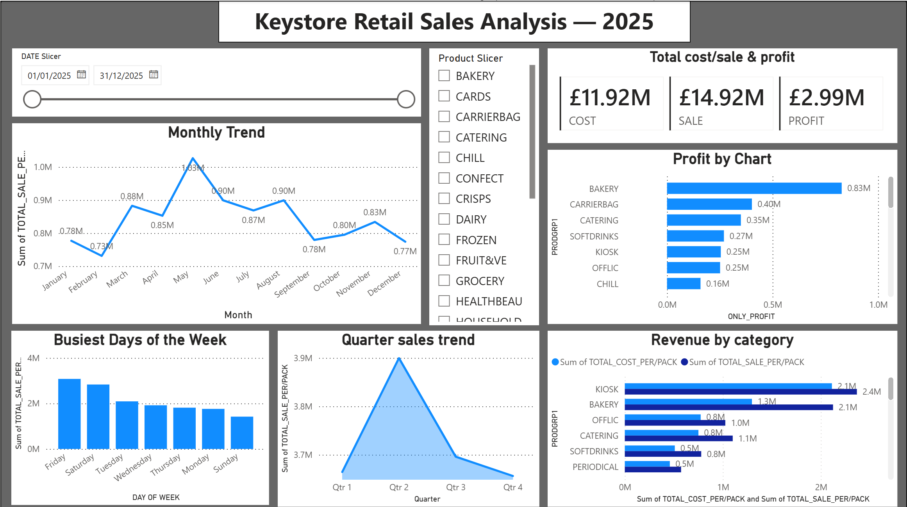
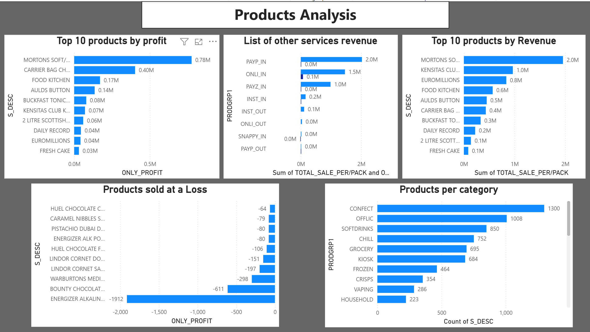

# Retail Sales Dashboard

## Overview

This Power BI dashboard was created using a real retail EPOS sales dataset.

The dashboard provides an overview of sales performance, product performance, and key business metrics. It was built after analysing the data using SQL and preparing the dataset for reporting.

---

# Tools Used

- Power BI
- SQL
- Firebird Database
- DBeaver

---

# Dashboard Features

The dashboard includes:

- Sales overview
- Revenue analysis
- Profit analysis
- Product performance
- Category performance
- Interactive filters
- KPI cards
- Charts and visual reports

---

# Dashboard Preview

## Dashboard 1

Overall retail sales performance dashboard.



---

## Dashboard 2

Detailed product and category analysis dashboard.



---

# Project Workflow

```
Firebird Database
        │
        ▼
SQL Queries
        │
        ▼
Power BI
        │
        ▼
Interactive Dashboard
```

---

# Skills Demonstrated

- Data Analysis
- SQL
- Power BI
- Data Visualization
- Dashboard Design
- Business Reporting

---

# Author

**Afzaal Ahmad**

MSc Data Science & Engineering

Power BI Portfolio Project
