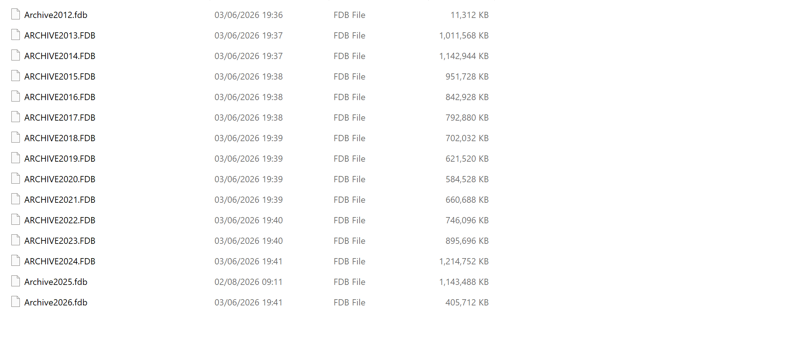

# 01_project-keystore

Sales analysis using **SQL, Python and Power BI**

# Retail Sales Analysis — Keystore Project

A retail sales analysis built using **SQL, Python and Power BI**, using real-world
retail EPOS data to answer practical business questions and demonstrate an
end-to-end analytics workflow.

Created by a recent Data Science graduate as a hands-on portfolio project.

See the full [28-question analysis plan](business-questions.md) for the business
questions driving this project, and the [`sql/`](sql/) folder for the queries and
detailed findings.

---

## Overview

This project takes real retail EPOS data — invoices, takings, product records
and sales history — and turns it into clear business insights.

The project combines:

- **SQL** for business analysis and data validation
- **Python** for data processing, anomaly detection, forecasting preparation
  and product segmentation
- **Power BI** for interactive business reporting

The goal was to answer questions a shop owner or manager actually cares about:



- Where is the profit really coming from?
- Which products make the most money, and which lose money?
- How are sales trending?
- Which products are performing unusually?
- Which products have high sales and strong margins?
- How can the data be prepared for future sales forecasting?

---

## The Data

The data was extracted from a **Firebird database**, covering tables such as
`SALES_HISTORY`, `INVDET`, `INVHEAD`, `TAKINGS`, `PRODUCT` and `PAYMENT`.

The core analysis focuses on the 2025 trading year.

`SALES_HISTORY` contains approximately **304,875 rows**.

> **Note:** The raw sales data is confidential business data and is **not included**
> in this repository. The code, queries and dashboard shown here use it for
> analysis only.

---

## Tools Used

- **SQL** — DBeaver / Firebird
- **Python** — pandas, NumPy, pathlib, logging and time
- **Power BI** — interactive dashboards
- **GitHub** — project version control and documentation

---

# What I Did

## 1. SQL Business Analysis

I created **28 SQL queries** based on practical retail business questions.

The analysis covers:

- Sales and revenue analysis
- Product performance
- Profitability
- Category analysis
- Monthly and daily trends
- Top and bottom products
- Ranking
- Window functions
- Subqueries
- Business validation

The SQL analysis was also used to validate important findings before presenting
them in the dashboards.

See the [`sql/`](sql/) folder for the complete analysis.

---

## 2. Data Validation

One of the most important findings was identifying a misleading field in the
source data.

The `GROSS_PROFIT` column actually stores a **margin percentage**, rather than
a monetary profit value.

Therefore, summing `GROSS_PROFIT` as if it were monetary profit would produce
misleading results.

I validated this against sample records and calculated true profit using:

```text
(SELL - COST) × QTY
