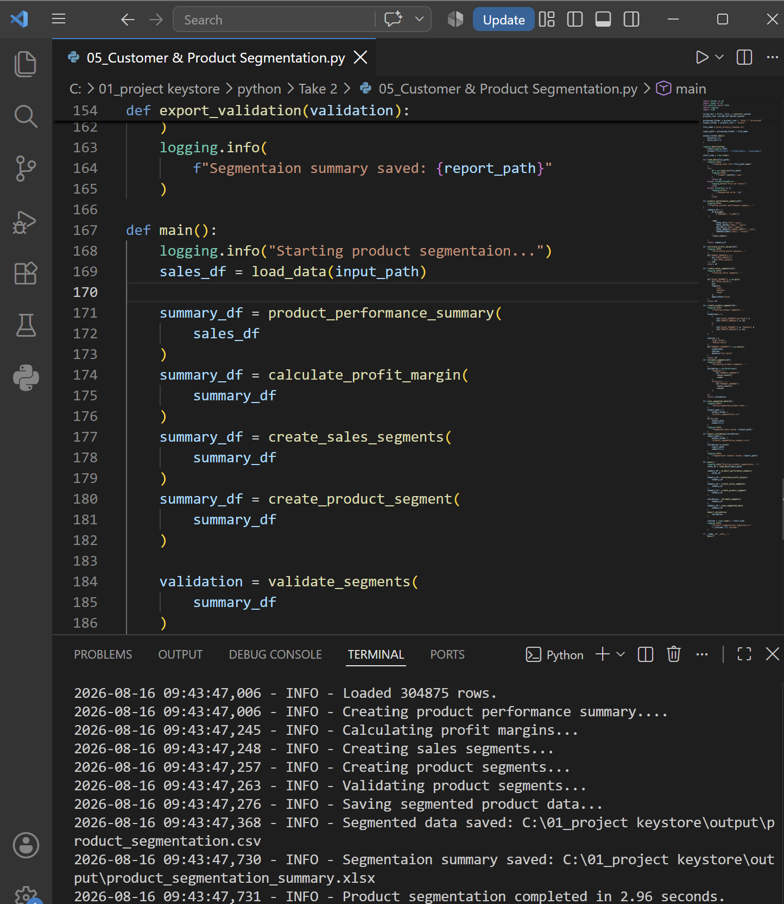
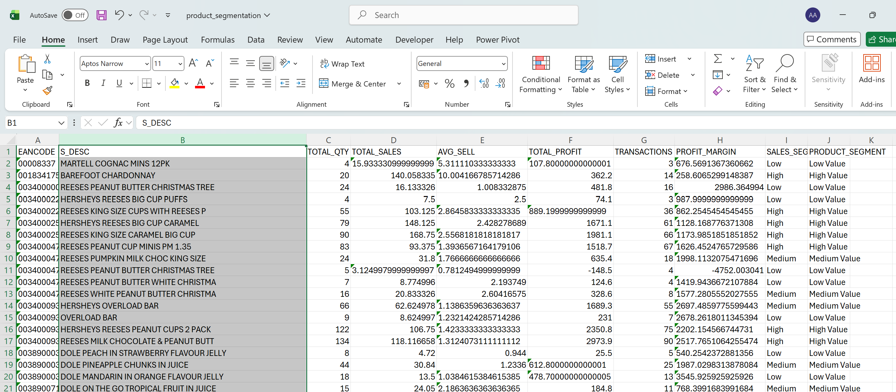

# Customer & Product Segmentation

A Python-based sales segmentation analysis using real retail/EPOS sales data.

The script groups products by **EANCODE** and **S_DESC**, calculates sales and profitability metrics, and assigns products to different value segments based on sales performance and profit margin.

## What This Script Does

* Loads cleaned retail sales data using Pandas
* Creates a product-level performance summary
* Calculates:

  * Total Quantity
  * Total Sales
  * Average Selling Price
  * Total Gross Profit
  * Number of Transactions
* Calculates **Profit Margin**
* Divides products into **Low, Medium, and High** sales segments
* Creates final product value segments:

  * **High Value**
  * **Medium Value**
  * **Low Value**
* Validates the number of products in each segment
* Exports the segmented dataset and summary report

## Segmentation Logic

Products are evaluated using both **sales performance** and **profit margin**.

| Sales Segment |    Profit Margin | Product Segment |
| ------------- | ---------------: | --------------- |
| High          |            ≥ 20% | High Value      |
| Medium        |            ≥ 10% | Medium Value    |
| Other         | Below thresholds | Low Value       |

This provides a simple way to identify products that generate strong sales while also maintaining healthy profitability.

## Visual Results

### Segmentation Overview

### Product Segmentation Results

## Output Files

The script generates:

* `product_segmentation.csv` — Product-level segmentation results
* `product_segmentation_summary.xlsx` — Summary of products by segment

## Technologies

* Python
* Pandas
* NumPy
* Logging
* Pathlib

## Purpose

This script demonstrates how Python can be used to move beyond basic reporting and perform **automated product performance analysis and segmentation** on retail sales data.

