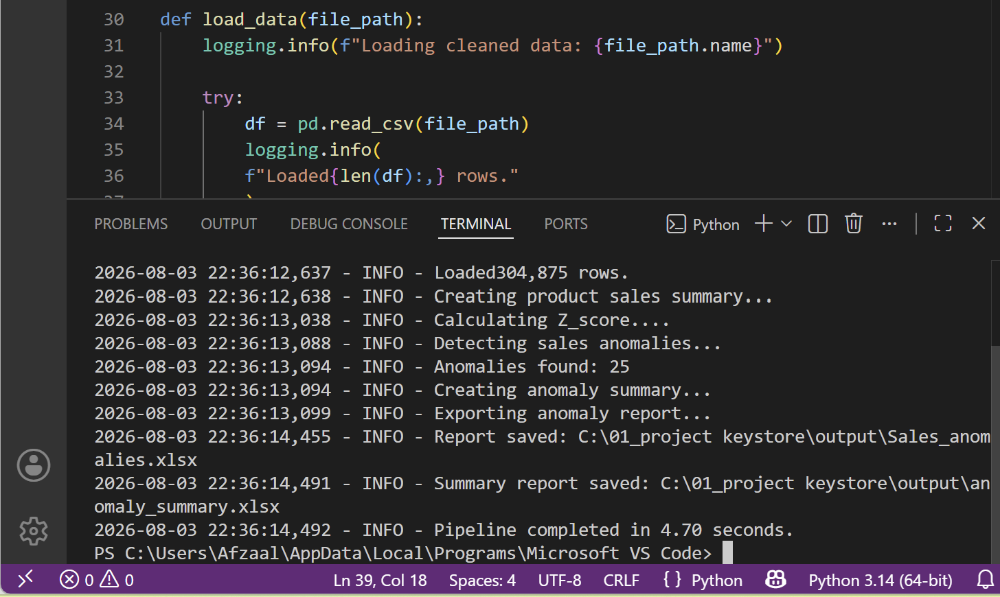
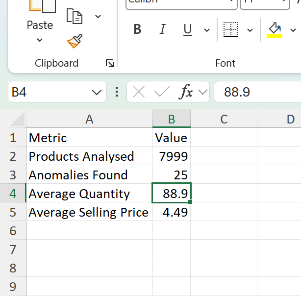

# Sales Anomaly Detection

## Overview

This project analyses cleaned retail sales data to find products with unusual sales behaviour.

The script groups sales by product, calculates sales statistics, detects anomalies using the Z-score method, and exports the results to Excel.

---

## Project Workflow

- Load the cleaned sales dataset
- Group sales by product
- Calculate sales statistics
- Calculate Z-score for each product
- Detect unusual products
- Export anomaly report
- Export summary report

---

## Files

| File | Description |
|------|-------------|
| `03_sales_anomaly_detection.py` | Python script for anomaly detection |
| `Sales_anomalies.xlsx` | List of products identified as anomalies |
| `anomaly_summary.xlsx` | Summary of the analysis |

---

## Techniques Used

- Python
- Pandas
- NumPy
- GroupBy
- Named Aggregation
- Z-score
- Logging
- Excel Export

---

## Output

The script creates two Excel reports.

### 1. Sales Anomalies

Contains products with unusual sales patterns based on their Z-score.

### 2. Summary Report

Shows:

- Products Analysed
- Anomalies Found
- Average Quantity
- Average Selling Price

---

## Screenshots

### Working in VS Code

---

### Anomaly Summary Report

---

## What I Learned

During this project I learned how to:

- Group large datasets using Pandas
- Calculate sales statistics
- Use the Z-score method to detect anomalies
- Export business reports to Excel
- Write modular Python functions
- Use logging instead of print statements

---

## Future Improvements

- Detect seasonal anomalies
- Create charts for anomaly trends
- Build an interactive Power BI dashboard
- Add machine learning forecasting
